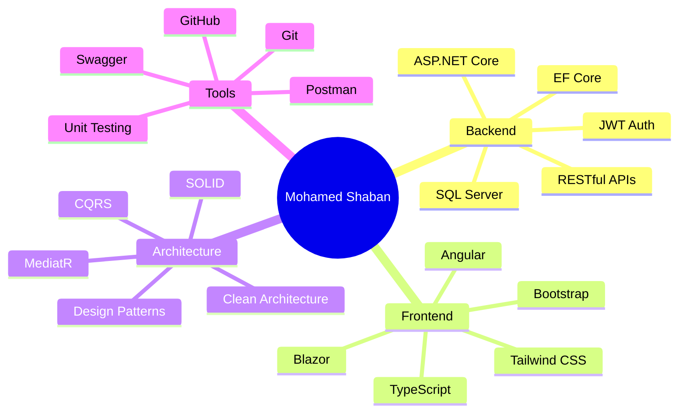

<!-- GitHub Profile README for Mohamed Shaban -->

<div align="center">

<!-- Animated Header -->


<!-- Typing Animation -->


<br />
<br />

<!-- Social Links -->
<a href="mailto:mohammedshaban1458@gmail.com">
  
</a>
<a href="https://www.linkedin.com/in/mohammedshaban99">
  
</a>
<a href="https://github.com/mohammedshaban99">
  
</a>
<a href="https://mohammedshaban99.github.io/My-Portfolio/">
  
</a>

<br />
<br />


</div>

---

##  About Me


I am a motivated **Full Stack .NET Developer** with strong experience in building modern, clean, scalable, and secure web applications.

I work mainly with **ASP.NET Core**, **Angular**, **Blazor**, **SQL Server**, and **Entity Framework Core**, and I enjoy applying software engineering best practices such as **Clean Architecture**, **CQRS**, **MediatR**, **SOLID Principles**, and **Design Patterns**.

- 🔭 Currently working as a **.NET Developer at Dexef**
- 🏗️ Building enterprise-level web applications using **ASP.NET Core, Blazor Server, and DevExpress**
- ⚙️ Experienced with **RESTful APIs, EF Core, LINQ, JWT Auth, ASP.NET Identity**
- 🧠 Interested in writing clean, maintainable, and scalable code
- 🚀 Always learning and improving as a software engineer
- 📍 Based in **Cairo, Egypt**

<br clear="right" />

---

## 🚀 Tech Stack

<div align="center">

### Backend


### Frontend


### Database & ORM


### Programming & Concepts


### Tools


</div>

---

## 🧩 Featured Projects

<div align="center">

<table>
<tr>
<td width="50%">

### 🛒 E-Commerce Blazor Application

A modern **Blazor Server (.NET 9)** e-commerce web application with interactive UI, secure authentication, product/category management, shopping cart, order processing, and Stripe payment integration.

**Built with:**

`Blazor Server` `ASP.NET Identity` `EF Core` `SQL Server` `Radzen UI` `Stripe`

</td>
<td width="50%">

### 📚 Library Management System

A powerful **.NET 8 Web API** for managing books, users, and borrowing records with JWT authentication and role-based access control.

**Built with:**

`.NET 8` `Web API` `JWT` `Repository Pattern` `Unit of Work` `Strategy Pattern`

</td>
</tr>
<tr>
<td width="50%">

### 🛍️ Online Store

A modern e-commerce web app built with **Angular 21**, allowing customers to browse products, filter by category, search items, manage cart, and handle authentication.

**Built with:**

`Angular` `TypeScript` `HTML` `CSS` `Authentication` `Shopping Cart`

</td>
<td width="50%">

### 🏢 HR Management System

Enterprise HR system built at Dexef using **ASP.NET Core**, **Blazor Server**, **DevExpress**, **CQRS**, **MediatR**, and **Clean Architecture**.

**Built with:**

`ASP.NET Core` `Blazor Server` `DevExpress` `CQRS` `MediatR` `EF Core`

</td>
</tr>
</table>

</div>

---

## 📊 GitHub Analytics

<div align="center">


<br />
<br />


</div>

---

## 🐍 Contribution Snake

<div align="center">


</div>

> To enable the snake animation, add the GitHub Action workflow shown below in your profile repository.

---

## ⚡ GitHub Action for Snake Animation

Create this file:

```txt
.github/workflows/snake.yml
```

Then paste:

```yml
name: Generate Snake Animation

on:
  schedule:
    - cron: "0 0 * * *"
  workflow_dispatch:

jobs:
  generate:
    permissions:
      contents: write
    runs-on: ubuntu-latest
    timeout-minutes: 5
    steps:
      - name: Generate github-contribution-grid-snake.svg
        uses: Platane/snk/svg-only@v3
        with:
          github_user_name: mohammedshaban99
          outputs: dist/snake.svg

      - name: Push snake.svg to output branch
        uses: crazy-max/ghaction-github-pages@v4
        with:
          target_branch: output
          build_dir: dist
        env:
          GITHUB_TOKEN: ${{ secrets.GITHUB_TOKEN }}
```

---

## 🧠 What I Focus On

<div align="center">



</div>

---

## 🎯 Current Goals

- Build more advanced full-stack applications
- Improve system design and architecture skills
- Write better clean code and reusable components
- Contribute to impactful real-world software projects
- Keep growing as a professional software engineer

---

## 📬 Contact Me

<div align="center">

<a href="mailto:mohammedshaban1458@gmail.com">
  
</a>
<a href="https://www.linkedin.com/in/mohammedshaban99">
  
</a>
<a href="https://mohammedshaban99.github.io/My-Portfolio/">
  
</a>

<br />
<br />


</div>
